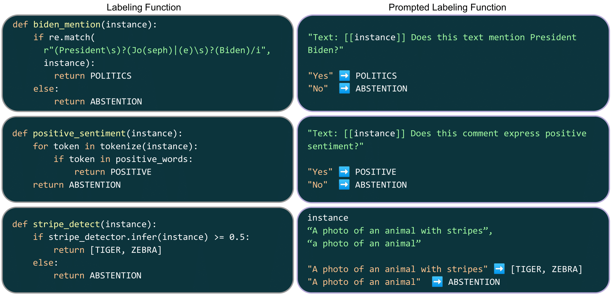

<h1 style="font-size: 48px">  </img>  Alfred: A System for Prompted Weak Supervision </h1>


Test Status:  

# News Update
- **[[Google Gemini](https://ai.google.dev/) Support]**
  Gemini is here!
  ```python
  gemini_pro = Client(model_type="google", model="gemini-pro", api_key=<your API key>)
  ```
- **[[GPT-4V](https://openai.com/research/gpt-4v-system-card) Support]**
  Alfred now supports GPT-4V(ision). Use it to streamline your image annotation tasks! For example:
  ```python
  openai = Client(model_type="openai", model="gpt-4-vision-preview")
  image = ... # load your image
  openai((image, f"What type is this document? Please choose from {label_space}"))
  ```
  
- **[[vLLM](https://github.com/vllm-project/vllm) Support]**
  Alfred now supports vLLM accelerated models! To use:
  ```python
  vLLMClient = Client(model_type="vllm", model=<your_favourite_model>)
  ```

- **[Embedding with Alfred]**
  Get a vector representation for any input strings! Alfred now supports embedding from locally hosted huggingface models or api-based calls from Cohere   and OpenAI. To use:
  ```python
  Client.encode(Union[str, List[str]]) -> Union[torch.tensor, List[torch.tensor]]
  ```

- **[Chat with GPTs, Gemini or Claude on Alfred]**
  Alfred now supports chat with anthropic, google gemini and openai api-based models, to use simply type:
  ```python
  from alfred import Client

  gpt = Client(model_type="openai", model="gpt-3.5-turbo")
  gpt.chat()
  # or chat with claude from Anthropic!
  claude = Client(model_type="anthropic", model="claude-2")
  claude.chat()

  gemini = Client(model_type="google", model="gemini-pro")
  gemini.chat()
  ```


# Overview

Alfred is a prototype framework for integrating large pretrained model into programmatic weak supervision pipelines.
Alfred provides an intuitive and user-friendly interface, enabling users to quickly create and refine prompts as supervision sources and interact with large models.
Furthermore, Alfred includes tools for label modeling, allowing the mixed signals from prompted model responses to be combined, distilled and denoised. 
Additionally, Alfred enables memory- and computation- intensive models to be run on cloud or computing clusters with optimized batching mechanisms, significantly increasing query throughput. 
Alfred aims to reduce annotation cost and time by making efficient use of LLMs, allowing users to make the most of their resources.




# Citation
If you find Alfred useful, please cite the following work. Thank you!

[Peilin Yu](https://www.yupeilin.com), [Stephen H. Bach](http://cs.brown.edu/people/sbach/). "Alfred: A System for Prompted Weak Supervision". ACL Demo, 2023.
```
@inproceedings{yu2023alfred,
  title = {Alfred: A System for Prompted Weak Supervision},
  author = {Yu, Peilin and Bach, Stephen H.}, 
  booktitle = {ACL Systen Demonstration}, 
  year = 2023, 
}
```

# Basics

##  <span style="color: cyan;">GUIDE 1</span>: Steps to setup and run Alfred locally
### 1. Install dependencies & Alfred
```bash
pip install -r requirements.txt
```
(Optional) It is highly recommended to use anaconda to create a virtual environment in alternative to the above command
```bash
conda create --name alfred
conda activate alfred
pip install -r requirements.txt
```
Run Alfred directly in its root directory or install it as a pip package at the end of the setup process.
```bash
pip install -e .
```

### 2. Run and play with the model!
```python
from alfred.client import Client


AlfredT0pp = Client(model_type="huggingface", model="bigscience/T0pp",
                local_path='/data/models/huggingface/')
# Or use API-based AI21/Cohere/OpenAI Models
GPTClient = Client(model_type="openai", model="gpt-3.5-turbo", api_key="<api_key>")

# Get the model's predictions for given queries:
AlfredT0pp("What is the capital of France?")
# This is equivalent to run a Completion Query
from alfred.fm.query import CompletionQuery
AlfredT0pp(CompletionQuery("What is the capital of France?"))

# Or you can run the model on a list of queries:
AlfredT0pp(["What is the capital of France?", "What is the capital of Germany?"])

# For ranking prompts, use RankedQuery
from alfred.fm.query import RankedQuery
query = RankedQuery("What is the capital of France?", ["Paris", "Berlin", "London"])
AlfredT0pp(query)
```

## <span style="color: cyan;">GUIDE 2</span>: Steps to setup Alfred Local Client/Server
### 1. Install dependencies on both local/server machine
```shell
pip install -r requirements.txt
```
### 2. Run the server with desired model and port
```shell
python -m alfred.run_server --model_type <model_type> --model <model_name> --local_path <model_ckpt_dir> --port <port_number>
```

> **_NOTE:_**  It is better to check the standard output logs to make sure the port number given is used by the server. If not, alfred will automatically find the nearest available port number.
##### Example
```shell
python -m alfred.run_server --model_type "huggingface" --model "bigscience/T0pp"  --local_path "/data/models/huggingface/" --port 10719
```
You may launch the server with cluster manager (e.g. SLURM) and use the login node as jump host.
A example slurm bash script:
```shell
#!/bin/bash
#SBATCH --job-name=alfred_server_session   
#SBATCH --nodes=1               
#SBATCH --partition=<partition>  --gres=gpu:4

python -m alfred.run_server --port 10719 --model_type "huggingface" --model "bigscience/T0pp"  --local_path '/data/models/huggingface/'
```


> **_NOTE:_** If you want to server the model for multiple users who may not have the credentials for your jump node, 
> you may use third-party tcp tunneling services (e.g. ngrok) to get a public URL and port for your server. You can then use the public URL and port to connect to the server from your local machine. 
### 3. Run Alfred Client on local machine

```python
from alfred.client import Client
t0pp = Client(model_type="huggingface", model="bigscience/t0pp", end_point="", ssh_tunnel=True, ssh_node="")
```

> **_NOTE:_** `end_point` contains user name, server address and port numbers in the form of `[username]@[server]:[port]`.The `ssh_tunnel` flag is used to indicate whether the client should use ssh tunnel to connect to the server. The `ssh_node` is only used if the server that is running the model is a compute node sitting behind a jump server. 
> For example if the server is running on `gpu1404` and the jump server is `ssh.ccv.brown.edu` then the `ssh_node` should be `gpu1404` and the `end_point` should be `[username]@ssh.ccv.brown.edu:[port_number]`. 
### 4. Play with it like alfred is running locally!
For completions, the simplest way is to use ```model(query)``` or ```model.run(query)```
```python
t0pp("Who are you?")

# Or for ranking prompts, use RankedQuery
from alfred.fm.query import RankedQuery
query = RankedQuery("What is the capital of France?", ["Paris", "Berlin", "London"])
t0pp(query)
```

## <span style="color: cyan;">GUIDE 5</span>: Using Alfred to generate prompts with template
### 1. Setup Alfred Client as in GUIDE 1/2 and import a StringTemplate
```python
from alfred.template import StringTemplate
```
### 2. Create the template and apply it to a example to generate a prompt
```python
example_template = StringTemplate(
    template = """Context: [text]\n\nIs the above messege about weather?""",
    answer_choices = None, # -> None if for completion, add "|||" delimilated strings for candidates scoring
)

example = {'text': "Finaly a pleasant day with sunny sky"}

prompt = example_template.apply(example)
# Now the prompt should be a CompletionQuery:
# CompletionQuery(content=Context: Finaly a pleasant day with sunny sky Is the above messege about weather?)
```

### 3. Now you can use the prompt to run the alfred client!
```python
t0pp(prompt)
```
The whole process can be simplified and distilled into one line as:
```python
t0pp(example_template(example))
```

## <span style="color: cyan;">GUIDE 4</span>: Using Alfred to generate annotations for large-scale dataset
### 1. Setup Alfred Client as in GUIDE 1/2/3
```python
from alfred.client import Client

t0pp = Client(...)
```

### 2. Define a dataset class, you may use huggingface datasets classes directly! For now we use a Wrench Benchmark dataset
```python
from alfred.data.wrench import WrenchBenchmarkDataset

spouse_test = WrenchBenchmarkDataset(
                                dataset_name='spouse',
                                split='test',
                                local_path="/users/pyu12/data/pyu12/datasets/wrench/"
                            )
```

### 3. Define a template for the dataset
```python
from alfred.template import StringTemplate

mention_template = StringTemplate(
    template = """Context: [text]\n\nIs there any mention of "spouse" between the entities [entity1] and [entity2]?""",
    answer_choices = None, # -> None if for completion, add "|||" delimilated strings for candidates scoring
)

mention_voter = Voter(
    label_map = {'yes': 2},
)

prompts = [mention_template.apply(instance) for instance in spouse_test]
```

### 4. Run the prompts with alfred client! Alfred can dynamically batch them to optimize throughput
```python
responses = t0pp(prompts)
```

### 5. Finally, we can get the votes from the responses based on the `label_maps` defined in the template
```python
votes = mention_voter.vote(responses)
```
